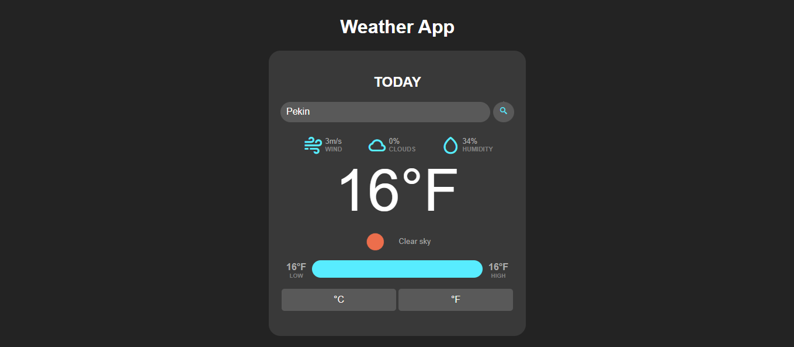

# Aplicacion del Clima
Esta es una aplicación para poder buscar el clima de una Ciudad.

## Conocimientos implementados:
- HTML y CSS
- Programación Imperativa  y POO en Javascript
- DOM
- Promesas y consultas a APIs

## Imagen
¡Haga click en la imagen para interactuar con la app!

  

